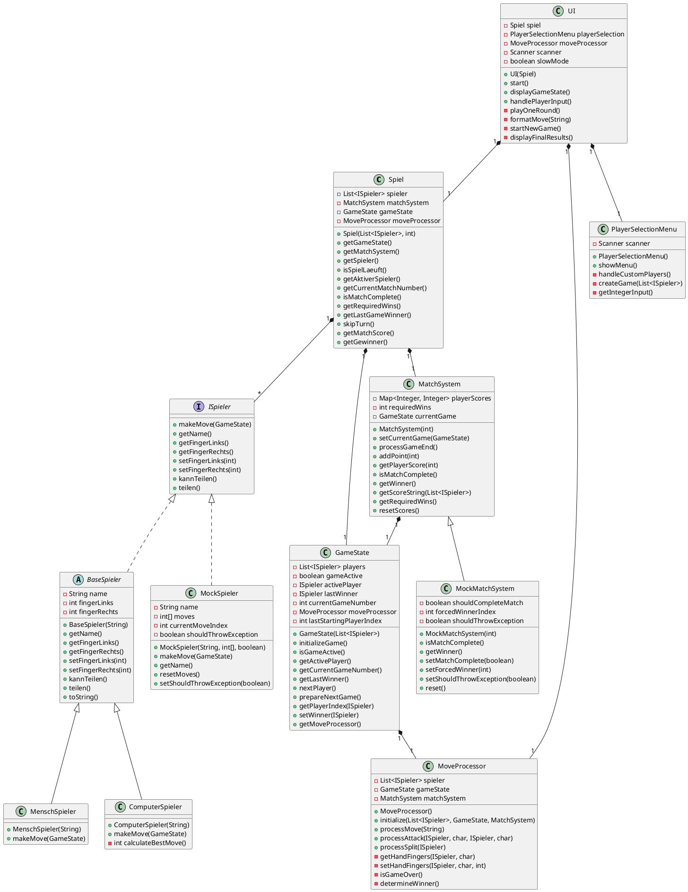

Dieses Lösungsdokument wurde vollständig in Obsidian verfasst und als Markdown-Datei gespeichert. Obwohl dieses Dokument primär im Markdown-Format vorliegt, sind zur Vollständigkeit auch  PDF-Version in der Lösungsbeilage enthalten. Der Code ist auf GitHub zu finden: [GitHub](https://github.com/bambooHDD/LB_M450-FingerSpiel)
# 1. Teilaufgabe - Testkonzept
Die Ausarbeitung zu Teilaufgabe 1 ist im diesem Dokument zu finden: LB-M450_Testkonzept_RoseSimon.md
# 2. Teilaufgabe - Mocking

## 2.1 Übersicht

Das Projekt verwendet zwei Haupt-Mocking-Klassen für Testzwecke:

1. `MockSpieler`- Mock-Implementierung des`ISpieler`-Interfaces
2. `MockMatchSystem`- Mock-Implementierung des`MatchSystem`
   Diese Mocking-Klassen ermöglichen kontrollierte Tests der Spiel-Logik, indem sie vorhersehbares Verhalten simulieren.
### 2.1.1 Klassendiagramm
Das Klassendiagramm wurde mit plantUML erstellt und ist im [WEB](https://www.plantuml.com/plantuml/png/pLRDRXit4BxhAGXVgiJQG-z14KT8NG6IOqWESYXweBbZYn2Nt99SosdGTo__DKkfWk1JVB1sPuRpyytms_beBDLswCJa5p9N6iXSK6F0J9Z_9PkUWo0_9iJzDMJ9ZVsm23BGln4J7v9oHItRRhuR2ntf3iz9Uqixs5XgWJpdftnElS2zLWoCKPfq-2rONCSafkFWCyAbVPSCdi4M_rCaH2bXSV9HHDm4oPB2y6InuStEyXVGs3vfveFM86E0kw5x77aBqhdgUW7ZVDRmzy0rjD-uD5Y-f2OKuEGIUJ8xtZyCMXwNn9GUERw5VJxwxyHrybxGxw1BBxcqe9ye0vBnIoszTftQWU_0j028tDuv6GxpEvVFe9TSxionU0riQmzoCpP7tJBL2QJQKIaVW0iur6ppgokCFXghARCa3kSdQY3NmptQ7KXhwXeRih7QnIFILPCaBYHvEcI7fIYpb04ACuskVbQ8qgkAMKRC8bGha8PjCp3mQa6s240q4DWIrtjwM508F_231Nr9a69xQHZK8KO56uGJVW9ZWraQUczDbkgPiuh4Yfl_8x8-N9Sy1ezA2Q0o4DKDymoG56MmQ936IrRhN4GRxp7EETA5JoIonONS5qu7bnjFqmwZ67GXMtXDQ9NgAeOiV2IvvLJmVy1R8fgwBVMDEA_KLZDULK9DO1LvITV_oakleQSQxfpcjhesgAnfhW1TXkGRQzB14O9uuX7tvxOxMVzX8IsuYpKZwI5tFt0gPWADoBh-YE66fbnGlEec8-IEMRQFkNlvPzaMI6ZRtYld1hjACALKa-Ry9wSWXoJXT6A8UcBEVwaqc7JSOAH7BRXiLpYp3PpP8gv9tUrwmkibuH1eXZrNu7klY8AGviPQodPbxcQ4RQdxFtwlpcnwmMqrget7z0ygsyZgflAOZSmv8xJnDEdsVdafhMr82nPqnoLy6wq2NnSL6pf1xb7m7rkJ96d0N5HckP8ha0FfnxABgMl3g4-4cFXRiQiHQhzIRRe-BgjfoARS6yztfSCjDpwBuoLlw-0IaDcZ7so1mzj_aR1MWsoBy4dfZjgZVZSnt1ti4IyrEQfh1nLhC8EmUEvFOlNZJEtNfqwKIinMxP6WIQND1sDL5m-QecCQg0ryNaqy6hV0RmcLF0mhnNRLE7ZHcvUeF_yAdJT7dxg0SQ3pkkrRDOZsOQlL_lChWxvCr3NE97Ld5cFCykbtbo-jcBAywMZhsfn8ObfY869ZEyn7UQEfFot7zMKc3fPukrIQGHilw1lGGO7VHly6xDWq1SPx9qen1BaKDWHu7hSr2EgDp9RtPXBPvkhNA_A-QS9lQT-n3eDSQzzVbV6S51VZmoCwmlqw7VxhOgG8pYlXgSjRcLHXFu9iXqxy1m00) besser ersichtlich.

## 2.2 MockSpieler

### 2.2.1 Zweck

Die`MockSpieler`-Klasse dient dazu, Spieler-Verhalten in Tests zu simulieren. Sie implementiert das`ISpieler`-Interface
und ermöglicht:

- Vordefinierte Züge
- Kontrollierte Ausnahmebehandlung
- Reset-Funktionalität

### 2.2.2 Verwendung

``` java
// Erstellung eines Mock-Spielers mit vordefinierten Zügen
MockSpieler mockSpieler = new MockSpieler("TestSpieler", new int[]{1, 2, 3}, false);

// Verwendung im Spiel
Spiel spiel = new Spiel(Arrays.asList(mockSpieler, otherPlayer), 3);

// Test der Züge
assertEquals(1, mockSpieler.makeMove(gameState));
assertEquals(2, mockSpieler.makeMove(gameState));
assertEquals(3, mockSpieler.makeMove(gameState));

// Reset der Züge
mockSpieler.resetMoves();

// Simulation von Ausnahmen
mockSpieler.setShouldThrowException(true);
assertThrows(RuntimeException.class, () -> mockSpieler.makeMove(gameState));
```

### 2.2.3 Implementierungsdetails

- Speichert Züge in einem Array
- Verfolgt den aktuellen Zug-Index
- Ermöglicht das Auslösen von Ausnahmen
- Bietet Reset-Funktionalität

## 2.3 MockMatchSystem

### 2.3.1 Zweck

Die`MockMatchSystem`-Klasse erweitert das`MatchSystem`und ermöglicht:

- Kontrollierte Match-Beendigung
- Erzwungene Gewinner
- Simulation von Ausnahmen

### 2.3.2 Verwendung

``` Java
// Erstellung eines Mock-Match-Systems
MockMatchSystem mockMatch = new MockMatchSystem(3);

// Erzwingen der Match-Beendigung
mockMatch.setMatchComplete(true);
assertTrue(mockMatch.isMatchComplete());

// Erzwingen eines Gewinners
mockMatch.setForcedWinner(1);
assertEquals(1, mockMatch.getWinner());

// Simulation von Ausnahmen
mockMatch.setShouldThrowException(true);
assertThrows(RuntimeException.class, () -> mockMatch.isMatchComplete());

// Reset des Mock-Systems
mockMatch.reset();
```

### 2.3.3 Implementierungsdetails

- Erbt von`MatchSystem`
- Ermöglicht das Erzwingen von Match-Ergebnissen
- Bietet Ausnahme-Simulation
- Enthält Reset-Funktionalität

## 2.4 Testbeispiel

### 2.4.1 Spieler-Tests

```java

@Test
void testMockSpieler() {
    MockSpieler mockSpieler = new MockSpieler("Test", new int[]{1, 2, 3});
    assertEquals(1, mockSpieler.makeMove(gameState));
    assertEquals(2, mockSpieler.makeMove(gameState));
    assertEquals(3, mockSpieler.makeMove(gameState));
}
```

### 2.4.2 Match-System-Tests

``` java
@Test
void testMockMatchSystem() {
    MockMatchSystem mockMatch = new MockMatchSystem(3);
    mockMatch.setMatchComplete(true);
    mockMatch.setForcedWinner(1);
    assertTrue(mockMatch.isMatchComplete());
    assertEquals(1, mockMatch.getWinner());
}
```

## 2.5 Vorteile der Mocking-Klassen

1. **Kontrollierte Tests**: Ermöglichen präzise Tests durch vordefiniertes Verhalten
2. **Isolation**: Erlauben das Testen einzelner Komponenten ohne Abhängigkeiten
3. **Reproduzierbarkeit**: Gewährleisten konsistente Testbedingungen
4. **Fehlersimulation**: Ermöglichen das Testen von Ausnahmebehandlung
5. **Flexibilität**: Bieten verschiedene Konfigurationsmöglichkeiten für Tests

## 2.6Anmerkung zum Mocking

Die Mocking-Klassen `MockSpieler` und `MockMatchSystem` wurden erstellt und initial getestet. Da mir das Mocking mit
diesen Klassen jedoch nicht vollständig vertraut ist und ich im beruflichen Kontext hauptsächlich die `when()`-Funktion
von Mockito verwende, werde ich in den folgenden Unit- und Integrationstests primär auf diese Methode zurückgreifen, um
das Verhalten von Objekten zu definieren und zu überprüfen.

# 3. Teilaufgabe - Inversion of Control

Inversion of Control (IoC) ist ein wichtiges Prinzip in der Softwareentwicklung, bei dem die Kontrolle über den
Programmfluss von den konkreten Implementierungen zu abstrakten Schnittstellen verlagert wird.

## 3.1 Dependency Injection im Spiel-Kern

Die Hauptklasse `Spiel` demonstriert IoC durch Dependency Injection. Anstatt die Abhängigkeiten selbst zu erstellen,
werden sie von aussen übergeben:

```java
public Spiel(List<ISpieler> spieler, int requiredWins) {
   this.spieler = spieler;
   this.gameState = new GameState(spieler);
   this.matchSystem = new MatchSystem(requiredWins);
    // ...
}
``` 

Die Spieler werden als Liste von `ISpieler`-Interfaces übergeben, was es ermöglicht, verschiedene
Spieler-Implementierungen (z.B. menschliche Spieler oder Computer-Spieler) flexibel einzusetzen.

## 3.2 UI-Komponente als Kontrollzentrum

Die `UI`-Klasse zeigt IoC durch die Umkehrung der Kontrolle über die Spielinitialisierung:

```java
public UI(Spiel spiel) {
   this.scanner = new Scanner(System.in);
   this.spiel = spiel;
   this.moveProcessor = new MoveProcessor();
}
```

Die UI kann entweder mit einem existierenden Spiel-Objekt initialisiert werden oder erstellt selbst ein neues Spiel über
den `PlayerSelectionMenu`. Dies ermöglicht eine flexible Initialisierung des Spiels von aussen.

## 3.3 Abstrakte Spieler-Schnittstelle

Die Verwendung des `ISpieler`-Interfaces ist ein weiteres Beispiel für IoC:

```java
private final List<ISpieler> spieler;
```

Durch die Verwendung der abstrakten Schnittstelle statt konkreter Implementierungen wird die Kontrolle über die Art der
Spieler von der Hauptlogik getrennt. Die Anwendung weiss nicht, ob es sich um menschliche oder Computer-Spieler
handelt - sie interagiert nur mit der abstrakten Schnittstelle.

## 3.3 Vorteile der IoC-Implementierung

Diese IoC-Implementierung macht die Anwendung:

- Flexibler (einfaches Hinzufügen neuer Spielertypen)
- Testbarer (einfaches Mocken von Spielern)
- Wartbarer (Trennung von Verantwortlichkeiten)
- Erweiterbarer (neue Funktionalität kann leicht hinzugefügt werden)

# 4. Teilaufgabe - Code Review nach SOLID

## 4.1 Was ist SOLID

Das SOLID-Prinzip ist eine Sammlung von fünf Designprinzipien, die in der objektorientierten Programmierung verwendet
werden, um Software verständlicher, flexibler und wartbarer zu machen. SOLID steht für

* **Single Responsibility Principle (SRP):** Jede Klasse soll nur eine Verantwortung haben.
* **Open-Closed Principle (OCP):** Offen für Erweiterungen, geschlossen für Änderungen.
* **Liskov Substitution Principle (LSP):** Abgeleitete Klassen sollen sich wie ihre Elternklassen verhalten (
  Kinderklasse *ist ein/e* Elternklasse). Keine Überraschungen!
* **Interface Segregation Principle (ISP):** Möglichst wenige Interface-Methoden, um die Klasse einfach und weniger
  fehleranfällig zu halten.
* **Dependency Inversion Principle (DIP):** Klassen hoher Ebenen sollten nicht von Klassen niedriger Ebenen abhängen.
  Beide sollten von Abstraktionen abhängen. Vermeide `new` für andere Klassen.

## 4.2 Single Responsibility Principle (SRP)

### 4.2.1 Aktuelle Implementierung

- Die `Spiel`-Klasse übernimmt mehrere Verantwortlichkeiten:
    - Spielkoordination
    - Spielerverwaltung
    - Matchsystem-Koordination
    - Zugverarbeitung
    - Punkteverwaltung
- Die `ISpieler`-Schnittstelle zeigt eine gute Trennung der Verantwortlichkeiten, da sie sich nur auf
  spielerspezifisches Verhalten konzentriert

### 4.2.2 Verbesserungsvorschläge

1. Erstellung einer separaten `ScoreManager`-Klasse für die Verwaltung der Punkte
2. Verlagerung der Match-Logik von `Spiel` zu `MatchSystem`

## 4.3 Open/Closed Principle (OCP)

### 4.3.1 Aktuelle Implementierung

- Das Spielsystem ist gut für Erweiterungen durch Schnittstellen strukturiert
- Die `ISpieler`-Schnittstelle ermöglicht neue Spielerimplementierungen
- Die Spielzustandsverwaltung ist gekapselt

### 4.3.2 Verbesserungsvorschläge

1. Erstellung einer abstrakten `GameMode`-Klasse für verschiedene Spielregelimplementierungen
2. Implementierung eines Strategie-Musters für die Zugvalidierung

## 4.4 Liskov Substitution Principle (LSP)

### 4.4.1 Aktuelle Implementierung

- Die `ISpieler`-Schnittstelle ist gut definiert und Implementierungen können ausgetauscht werden
- Die Spielzustandsverwaltung folgt den LSP-Prinzipien

### 4.4.2 Verbesserungsvorschläge

1. Hinzufügen von Validierung in `ISpieler`-Implementierungen, um sicherzustellen, dass Fingerwerte im gültigen Bereich
   bleiben
2. Implementierung einer ordnungsgemässen Fehlerbehandlung für ungültige Züge

## 4.5 Interface Segregation Principle (ISP)

### 4.5.1 Aktuelle Implementierung

- Die `ISpieler`-Schnittstelle ist gut aufgeteilt
- Spielkomponenten haben klare Schnittstellen

### 4.5.2 Verbesserungsvorschläge

1. Aufteilung von `GameState` in kleinere, fokussiertere Schnittstellen
2. Erstellung separater Schnittstellen für Zugvalidierung und Spielregeln

## 4.6 Dependency Inversion Principle (DIP)

### 4.6.1 Aktuelle Implementierung

- Gute Verwendung von Schnittstellen für die Spielerverwaltung
- Einige direkte Abhängigkeiten von konkreten Implementierungen

### 4.6.2 Verbesserungsvorschläge

1. Verwendung von Dependency Injection für Spielkomponenten
2. Erstellung von Schnittstellen für `MatchSystem` und `MoveProcessor`

# 5. Teilaufgabe - Unit-Test

Im Rahmen der Anforderungsanalyse wurde ein Code Coverage von 80% als Zielvorgabe definiert. Um dieses Ziel zu
erreichen, wurden umfangreiche Unittests für die Kernkomponenten des Spiels implementiert. Der Fokus lag dabei auf der
Testabdeckung der zentralen Spielmechaniken und -logik.

## 5.1 Testumfang und -strategie

Die Unittests wurden hauptsächlich für folgende Komponenten implementiert:

- GameState: Testet den Spielzustand und dessen Verwaltung
- MatchSystem: Prüft die Match-Logik und Punkteverwaltung
- MoveProcessor: Testet die Verarbeitung von Spielzügen
- Spieler-Klassen: Überprüft die Spielerlogik und -interaktionen
  Die UI-Komponenten wurden bewusst von den Unittests ausgenommen, da diese hauptsächlich Präsentationslogik enthalten
  und wenig geschäftskritische Funktionalität aufweisen. Stattdessen wurde der Fokus auf die Testabdeckung der
  Kernspiellogik gelegt, die für die korrekte Funktionsweise des Spiels essentiell ist.

## 5.2 Teststruktur

Die Tests sind in zwei Hauptkategorien unterteilt:

1. Unit Tests: Testen einzelne Komponenten isoliert
2. Integration Tests: Überprüfen das Zusammenspiel verschiedener Komponenten
   Beispielsweise wurden die Tests für GameState und MatchSystem so strukturiert, dass sie sowohl isolierte
   Funktionalität als auch die Integration zwischen diesen Komponenten abdecken. Dies ermöglicht eine umfassende
   Testabdeckung der Spielmechaniken.

## 5.3 Testqualität und -abdeckung

Die implementierten Tests decken folgende Aspekte ab:

- Initialisierung und Statusverwaltung
- Spielzugverarbeitung
- Siegbedingungen und Match-Management
- Fehlerbehandlung und Randfälle
  Durch diese umfassende Testabdeckung wird sichergestellt, dass die Kernfunktionalität des Spiels zuverlässig
  funktioniert und Änderungen am Code keine unerwarteten Nebeneffekte haben.

## 5.4 Test Generierung

Um nicht unnötig viel Zeit zu verlieren, wurden die Grundstruktur und Inhalt beschrieben und per Claude 3.7 Sonnet
generiert und angepasst.

# 6. Teilaufgabe - Debugging

## 6.1 Problembeschreibung

Der Test`testGameOver`in`TestGameMode`schlägt mit einer`NullPointerException`fehl, weil`activePlayer`null ist, wenn
versucht wird auf`getFingerLinks()`zuzugreifen. Dies tritt in der Methode`StandardGameMode.isGameOver()`auf.

## 6.2 Fehleranalyse

Der Fehler tritt auf, weil:

1. Der Test ein`GameState`mit zwei Spielern einrichtet
2. Der Test die Finger von Spieler 1 auf 0 setzt (beide Hände)
3. Wenn`isGameOver()`aufgerufen wird, versucht es auf`activePlayer`zuzugreifen, der null ist
4. Dies zeigt, dass`GameState`das`activePlayer`-Feld nicht korrekt initialisiert

## 6.3 Debugging-Schritte

### 6.3.1 Breakpoints setzen

1. `StandardGameMode.java` öffnen und einen Breakpoint in Zeile 30 setzten:

```java
ISpieler activePlayer = state.getActivePlayer();
```

2. `GameState.java` öffnen und Breakpoints setzten:
    - Zeile 20 (Konstruktor)
    - Zeile 30 (initializeGame-Methode)
    - Zeile 50 (nextPlayer-Methode)

### 6.3.2 Debugger starten

1. Rechtsklick auf`testGameOver`in`TestGameMode.java`
2. "Debug 'testGameOver'" wählen und ausführen
3. Der Debugger stoppt am ersten Breakpoint

### 6.3.3 Debugging-Prozess

1. Wenn der Debugger bei`StandardGameMode.java`Zeile 30 stoppt:
    - `state`-Variable untersuchen
    - `activePlayer` ist null
    - Dies zeigt, dass der Spielzustand nicht korrekt initialisiert wurde
2. In`getActivePlayer()`hinein gehen, um zu sehen, warum es null zurückgibt
    - Der Debugger führt zu`GameState.java`
    - `activePlayer` wurde nie gesetzt
3. Betrachtung des Test-Setups:
    - Der Test erstellt ein neues`GameState`mit Spielern
    - Aber er ruft nie`initializeGame()`auf
    - Deshalb bleibt`activePlayer`null

## 6.4 Lösung

In`TestGameMode.java`, `initializeGame()`-Aufruf nach der Erstellung des`GameState`hinzufügen:

```java

@BeforeEach
void setUp() {
    spieler = Arrays.asList(
            new MenschSpieler("Spieler1"),
            new MenschSpieler("Spieler2")
    );
    gameState = new GameState(spieler);
    gameState.initializeGame();  // Diese Zeile hinzufügen
    gameMode = new StandardGameMode();
}
```

# 7. Teilaufgabe - Test Driven Development

## 7.1 Test Driven Development für ScoreManager

### 7.1.1 Testfälle definieren

Zuerst definieren wir die Testfälle für den`ScoreManager`:

``` java 
public class TetsScoreManager {  
    private ScoreManager scoreManager;  
    private List<ISpieler> spieler;  
  
    @BeforeEach  
    void setUp() {  
        spieler = Arrays.asList(  
                new MenschSpieler("Spieler1"),  
                new MenschSpieler("Spieler2")  
        );  
        scoreManager = new ScoreManager(spieler);  
    }  
  
    @Test  
    void testInitialScore() {  
        assertEquals(0, scoreManager.getScore(spieler.get(0)));  
        assertEquals(0, scoreManager.getScore(spieler.get(1)));  
    }  
  
    @Test  
    void testUpdateScore() {  
        scoreManager.updateScore(spieler.get(0));  
        assertEquals(1, scoreManager.getScore(spieler.get(0)));  
        assertEquals(0, scoreManager.getScore(spieler.get(1)));  
    }  
  
    @Test  
    void testScoreString() {  
        scoreManager.updateScore(spieler.get(0));  
        String expected = "Spieler1: 1, Spieler2: 0";  
        assertEquals(expected, scoreManager.getScoreString(spieler));  
    }  
  
    @Test  
    void testHasPlayerWon() {  
        for (int i = 0; i < 3; i++) {  
            scoreManager.updateScore(spieler.get(0));  
        }  
        assertTrue(scoreManager.hasPlayerWon(spieler.get(0), 3));  
        assertFalse(scoreManager.hasPlayerWon(spieler.get(1), 3));  
    }  
}
```

### 7.1.2 Implementierung des ScoreManager

Basierend auf den Testfällen implementieren wir den`ScoreManager`:

``` java
public class ScoreManager {  
    private final Map<ISpieler, Integer> scores;  
      
    public ScoreManager(List<ISpieler> players) {  
        scores = new HashMap<>();  
        players.forEach(p -> scores.put(p, 0));  
    }  
      
    public void updateScore(ISpieler winner) {  
        scores.merge(winner, 1, Integer::sum);  
    }  
      
    public String getScoreString(List<ISpieler> players) {  
        return players.stream()  
            .map(p -> p.getName() + ": " + scores.get(p))  
            .collect(Collectors.joining(", "));  
    }  
      
    public int getScore(ISpieler player) {  
        return scores.getOrDefault(player, 0);  
    }  
      
    public boolean hasPlayerWon(ISpieler player, int requiredWins) {  
        return getScore(player) >= requiredWins;  
    }  
}
```

## 7.2 Test Driven Development für GameMode

### 7.2.1 Testfälle definieren

``` java
public class TestGameMode {  
    private GameMode gameMode;  
    private GameState gameState;  
    private List<ISpieler> spieler;  
  
    @BeforeEach  
    void setUp() {  
        spieler = Arrays.asList(  
                new MenschSpieler("Spieler1"),  
                new MenschSpieler("Spieler2")  
        );  
        gameState = new GameState(spieler);  
        gameMode = new StandardGameMode();  
    }  
  
    @Test  
    void testValidMove() {  
        assertTrue(gameMode.isValidMove(spieler.get(0), spieler.get(1), 1));  
        assertTrue(gameMode.isValidMove(spieler.get(0), spieler.get(1), 4));  
        assertFalse(gameMode.isValidMove(spieler.get(0), spieler.get(1), 0));  
        assertFalse(gameMode.isValidMove(spieler.get(0), spieler.get(1), 5));  
    }  
  
    @Test  
    void testGameOver() {  
        spieler.get(0).setFingerLinks(0);  
        spieler.get(0).setFingerRechts(0);  
        assertTrue(gameMode.isGameOver(gameState));  
    }  
  
    @Test  
    void testDetermineWinner() {  
        spieler.get(0).setFingerLinks(0);  
        spieler.get(0).setFingerRechts(0);  
        assertEquals(spieler.get(1), gameMode.determineWinner(gameState));  
    }  
}
```

### 7.2.2 Implementierung des GameMode

```java
public abstract class GameMode {
    public abstract boolean isValidMove(ISpieler source, ISpieler target, int move);

    public abstract boolean isGameOver(GameState state);

    public abstract ISpieler determineWinner(GameState state);

    protected boolean isValidFingerValue(int value) {
        return value >= 0 && value <= 5;
    }

    protected boolean hasValidFingers(ISpieler player) {
        return isValidFingerValue(player.getFingerLinks()) &&
                isValidFingerValue(player.getFingerRechts());
    }
}

public class StandardGameMode extends GameMode {
    @Override
    public boolean isValidMove(ISpieler source, ISpieler target, int move) {
        if (!hasValidFingers(source) || !hasValidFingers(target)) {
            return false;
        }

        if (move < 1 || move > 4) {
            return false;
        }

        int targetLeft = target.getFingerLinks();
        int targetRight = target.getFingerRechts();

        return (move == 1 && targetLeft > 0) ||
                (move == 2 && targetRight > 0) ||
                (move == 3 && targetLeft > 0) ||
                (move == 4 && targetRight > 0);
    }

    @Override
    public boolean isGameOver(GameState state) {
        ISpieler activePlayer = state.getActivePlayer();
        return activePlayer.getFingerLinks() == 0 && activePlayer.getFingerRechts() == 0;
    }

    @Override
    public ISpieler determineWinner(GameState state) {
        return state.getPlayers().stream()
                .filter(p -> p.getFingerLinks() > 0 || p.getFingerRechts() > 0)
                .findFirst()
                .orElse(null);
    }
}
```

## 7.3 Integration in die Hauptklasse

Die Implementierung wird in die`Spiel`-Klasse integriert:

``` java
public class Spiel {
    private final List<ISpieler> spieler;
    private final MatchSystem matchSystem;
    private final GameState gameState;
    private final MoveProcessor moveProcessor;
    private final ScoreManager scoreManager;
    private final GameMode gameMode;

    public Spiel(List<ISpieler> spieler, int requiredWins) {
        this.spieler = spieler;
        this.gameState = new GameState(spieler);
        this.matchSystem = new MatchSystem(requiredWins);
        this.moveProcessor = gameState.getMoveProcessor();
        this.scoreManager = new ScoreManager(spieler);
        this.gameMode = new StandardGameMode();
        this.matchSystem.setCurrentGame(this.gameState);
        gameState.initializeGame();
    }
    
    // ... weitere Methoden ...
}
```

# 8. Teilaufgabe - Testen

## 8.1 Testprotokoll

| Test-Nr. | Testfall-Nr.                                | Datum      | Tester     | Resultat | Bemerkung                                       | Unterschrift |
|:---------|:--------------------------------------------|:-----------|:-----------|:---------|:------------------------------------------------|:-------------|
| 1        | F1: MenschSpieler Eingabe                   | 13.04.2025 | Simon Rose | OK       | Eingaben L1R und R2L wurden korrekt verarbeitet | S. Rose      |
| 2        | F2: AISpieler Logik                         | 13.04.2025 | Simon Rose | OK       | KI wählt valide Züge                            | S. Rose      |
| 3        | F3: Spiel-Initialisierung mit zwei Spielern | 13.04.2025 | Simon Rose | OK       | Spieler wurden korrekt initialisiert            | S. Rose      |
| 4        | F4: Standard-Fingeranzahl                   | 13.04.2025 | Simon Rose | OK       | Jeder Spieler startet mit 1 Finger pro Hand     | S. Rose      |
| 5        | F5: Gültige Quellhand                       | 13.04.2025 | Simon Rose | OK       | L/R werden akzeptiert, X wird abgelehnt         | S. Rose      |
| 6        | F6: Gültiger Zielspieler                    | 13.04.2025 | Simon Rose | OK       | 1/2 werden akzeptiert, 3 wird abgelehnt         | S. Rose      |
| 7        | F7: Gültige Zielhand                        | 13.04.2025 | Simon Rose | OK       | L/R werden akzeptiert, X wird abgelehnt         | S. Rose      |
| 8        | F8: Finger-Addition                         | 13.04.2025 | Simon Rose | OK       | Addition erfolgt korrekt (2+2=4)                | S. Rose      |
| 9        | F9: Kein Angriff auf leere Hände            | 13.04.2025 | Simon Rose | OK       | Angriff wird als ungültig erkannt               | S. Rose      |
| 10       | F10: Kein Selbst-Angriff                    | 13.04.2025 | Simon Rose | OK       | Selbstangriff wird als ungültig erkannt         | S. Rose      |
| 11       | F11: Finger-Teilung                         | 13.04.2025 | Simon Rose | OK       | 4 Finger werden zu 2+2 aufgeteilt               | S. Rose      |
| 12       | F12: Match-System Best-of                   | 13.04.2025 | Simon Rose | OK       | Match endet nach 2 Siegen korrekt               | S. Rose      |
| 13       | Q1: Fehlermeldungen                         | 13.04.2025 | Simon Rose | NOK      | Es gibt nur eine Fehler meldung: Invalid Move   | S. Rose      |
| 14       | Q2: Spielzug-Eingabe                        | 13.04.2025 | Simon Rose | OK       | Eingabeaufforderung ist verständlich            | S. Rose      |
| 15       | Q3: Spielstand-Anzeige                      | 13.04.2025 | Simon Rose | OK       | Übersichtliche Darstellung des Spielstands      | S. Rose      |
| 16       | Q4: Zug-Validierung                         | 13.04.2025 | Simon Rose | OK       | Alle ungültigen Züge werden erkannt             | S. Rose      |
| 17       | Q5: Code Coverage                           | 13.04.2025 | Simon Rose | OK       | 84% Coverage erreicht (70% mit UI)              | S. Rose      |
| 18       | R1: Englische Sprache                       | 13.04.2025 | Simon Rose | NOK      | Variablen und Methoden teilweise Deutsch        | S. Rose      |
# 9. Fazit
Wenn ich das Projekt noch einmal machen könnte, würde ich einen völlig anderen Ansatz wählen. Der Code des Spiels ist durch das ständige Hin- und Herschieben und die unterschiedlichen Entwicklungsansätze ziemlich durcheinandergeraten. Hinzu kommt, dass ich den grössten Teil des Codes in den ersten ein bis zwei Tagen nach Erhalt der LB fertiggestellt hatte. Danach begann ich mit der LB selbst, also dem Testkonzept usw. Dann war ich mental nicht wirklich bei der Sache und konnte zwei Wochen lang kaum daran arbeiten. Als ich dann wieder daran gearbeitet habe, hatte ich das Gefühl, alles noch einmal neu zu machen, aber ich habe nur noch Code hin- und hergeschoben, was ein ziemliches Chaos verursacht hat.
Die gesamte Planung würde ich ebenfalls überdenken, da ich mich aufgrund meiner eigenen Probleme nicht an meinen ursprünglichen Plan halten konnte. Ausserdem würde ich mir gerne noch einmal das Mocking ansehen, da ich das mit den Mocking-Klassen nicht ganz verstanden habe, was aber eigentlich wichtig ist. Wie jedoch bereits in der Dokumentation erwähnt, habe ich dies mit der `when()`-Methode in den Unit-Tests gelöst. Vielleicht ist das schon die richtige Art und Weise, und ich hätte die Klassen gar nicht gebraucht. Das würde ich aber gerne kurz besprechen, falls das möglich ist. Ebenso würde ich gerne ein oder zwei Dinge besprechen (ich weiss, das gehört hier vielleicht nicht hinein, aber nun ja, jetzt ist es so).
Alles in allem fand ich das Modul jedoch sehr interessant, und es hat meine Kenntnisse über Tests aufgefrischt, was mir in der Lehre sehr helfen wird, da ich einige Tests schreiben muss. Aber zurück zur LB: Ich habe zu viel Zeit damit verbracht, den Code für das Spiel zu erstellen, anstatt mich auf die Tests und alles Drumherum zu konzentrieren. Gerne wähle ich das nächste Mal etwas weniger Komplexes, damit ich mich auf die LB selbst konzentrieren kann.
# 10. Selbständigkeitserklärung 
Hiermit erkläre ich, dass ich die vorliegende Arbeit selbstständig und ohne fremde Hilfe verfasst und keine anderen Hilfsmittel als die angegebenen verwendet habe.

Insbesondere versichere ich, dass ich alle wörtlichen und sinngemässen Übernahmen aus anderen Werken als solche kenntlich gemacht habe.

13.04.2025 (Ort, Datum) Simon C. Rose (Unterschrift)